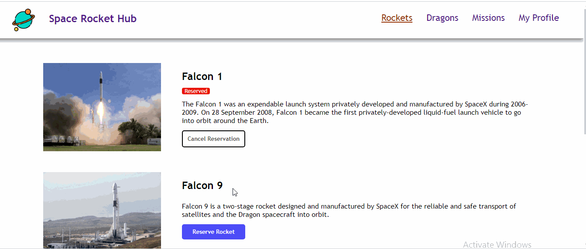

# SPACE ROCKETS AND MISSIONS

SPA that gets data from an API and displays that information on the different pages.
- The app has a rocket page, mission page and dragon page
- Rockets can be reserved as well as reservation can be cancelled
- Missions can be joined and left as well
- All reserved rockets and joined missions are displayed in the profile page
- All information on the different pages are gotten from a given API

# LIVE PREVIEW
> 

# TEST
> 

# BUILT WITH
- LANGUAGE:
> JavaScript
> Html
> Css
- FRAMEWORK:
>
- LIBRARY: 
> React , Redux

# Live links
> 

> [LIVE PREVIEW](https://space-ships-and-missions.netlify.app/)

## Authors

👤 **Author1**

- GitHub: [@tufoinnkuo10](https://github.com/tufoinnkuo10)

👤 **Author2**

- GitHub: [@azy64](https://github.com/azy64)
- LinkedIn: [LinkedIn](https://www.linkedin.com/in/azaria-saidi-524780112/)

👤 **Author2**

- GitHub: [@ifnotlily](https://github.com/ifnotlily)

## Available Scripts

In the project directory, you can run:

### `npm start`

Runs the app in the development mode.\
Open [http://localhost:3000](http://localhost:3000) to view it in the browser.

The page will reload if you make edits.\
You will also see any lint errors in the console.

### `npm test`

Launches the test runner in the interactive watch mode.\
See the section about [running tests](https://facebook.github.io/create-react-app/docs/running-tests) for more information.

### `npm run build`

Builds the app for production to the `build` folder.\
It correctly bundles React in production mode and optimizes the build for the best performance.

## 🤝 Contributing

Contributions, issues, and feature requests are welcome!

Feel free to check the [issues page](../../issues/).

## Show your support

Give a ⭐️ if you like this project!

## Acknowledgments

- Hat tip to anyone whose code was used
- Inspiration
- etc

## 📝 License

This project is [MIT](./MIT.md) licensed.